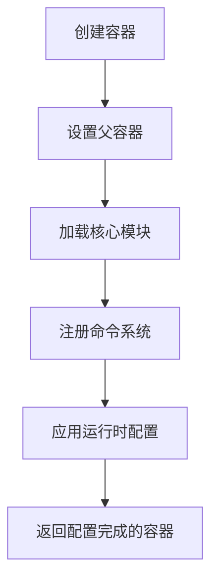
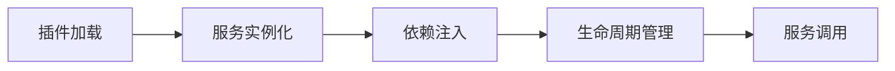
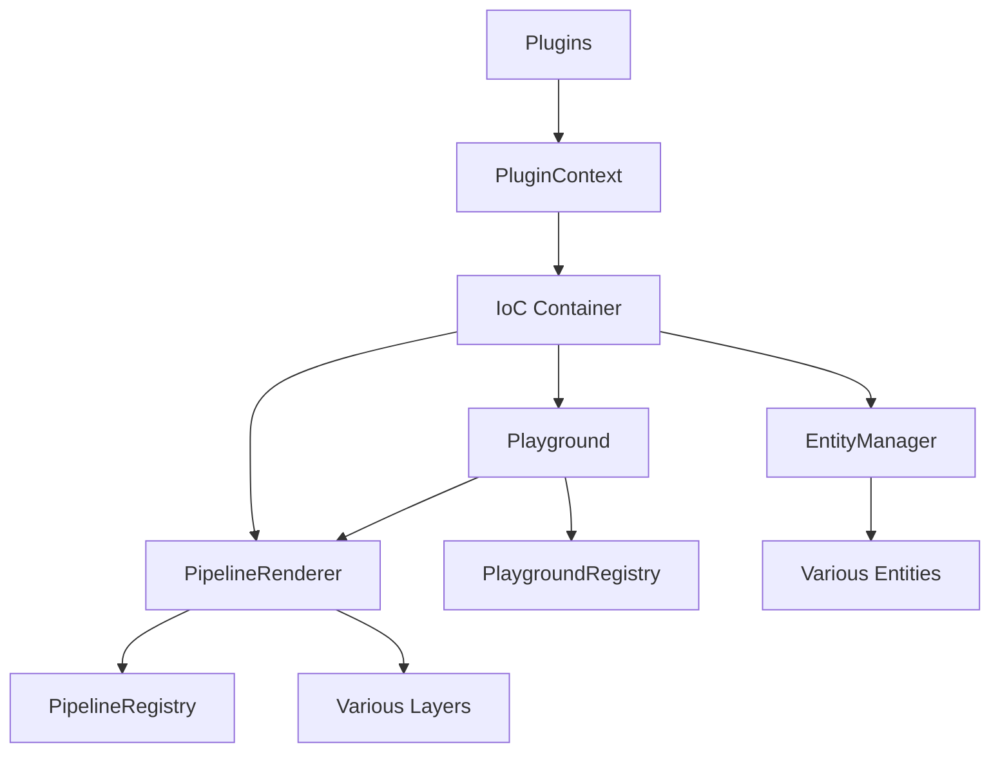
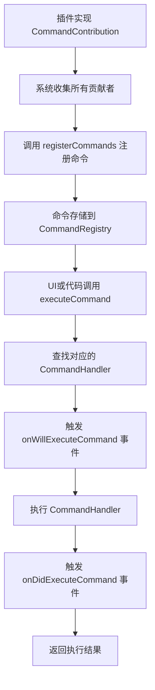
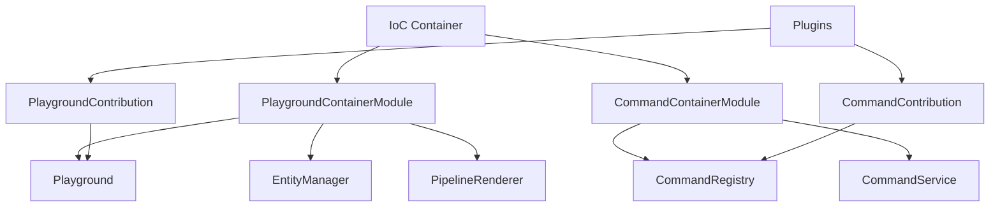

# createPlaygroundContainer 深度分析

## 🎯 函数概述

`createPlaygroundContainer` 是 FlowGram.AI 的**IoC 容器工厂函数**，负责创建和配置整个画布系统的依赖注入容器。它是整个架构的**基础设施核心**。

## 📋 函数签名分析

```typescript
export function createPlaygroundContainer(
  config?: PlaygroundConfig, // 画布配置
  parent?: interfaces.Container, // 父容器（支持容器层级）
  container?: interfaces.Container // 自定义容器（可选）
): interfaces.Container;
```

### 参数设计意图

1. **config**: 运行时配置注入
2. **parent**: 支持容器继承，实现服务共享
3. **container**: 允许外部提供自定义容器

## 🏗️ 核心实现分析

### 第 1 步：容器创建与配置

```typescript
const child = container || new Container({ defaultScope: "Singleton" });
if (parent) {
  child.parent = parent;
}
```

**设计亮点**：

- **默认单例模式**: `defaultScope: 'Singleton'` 确保服务实例唯一性
- **容器继承**: 支持从父容器继承服务，实现分层依赖管理
- **灵活性**: 允许外部提供自定义容器

### 第 2 步：核心模块加载

```typescript
child.load(PlaygroundContainerModule);
```

这一行代码加载了**27 个核心服务**，是整个系统的服务注册中心。

### 第 3 步：命令系统注册

```typescript
if (!child.isBound(CommandService)) {
  child.load(CommandContainerModule);
}
```

**智能注册**：只有当 `CommandService` 未绑定时才加载，避免重复注册。

### 第 4 步：运行时配置应用

```typescript
if (config) {
  child.rebind(PlaygroundConfig).toConstantValue(config);
  if (config.context) {
    child.rebind(PlaygroundContext).toConstantValue(config.context);
  }
}
```

**配置覆盖**：运行时配置会覆盖默认配置。

## 🔧 PlaygroundContainerModule 核心服务分析

`PlaygroundContainerModule` 是 FlowGram.AI 的**核心服务注册模块**，负责注册系统运行所需的所有基础服务。

### 📋 完整服务清单

```typescript
export const PlaygroundContainerModule = new ContainerModule(bind => {
  // 🏛️ 核心架构服务
  bind(EntityManager).toSelf().inSingletonScope();
  bind(Playground).toSelf().inSingletonScope();
  bind(PlaygroundRegistry).toSelf().inSingletonScope();

  // 🎨 渲染管道服务
  bind(PipelineRenderer).toSelf().inSingletonScope();
  bind(PipelineRegistry).toSelf().inSingletonScope();
  bind(PipelineEntitiesSelector).toSelf().inSingletonScope();

  // 🏭 工厂服务
  bind(PipelineLayerFactory).toDynamicValue(...).inSingletonScope();
  bind(PlaygroundContainerFactory).toDynamicValue(...).inSingletonScope();

  // 🔧 配置服务
  bind(PlaygroundConfig).toConstantValue(createDefaultPlaygroundConfig());
  bind(PlaygroundContext).toConstantValue({});
  bindConfigEntity(bind, PlaygroundConfigEntity);
  bindPlaygroundContextProvider(bind);

  // 🎮 交互服务
  bind(ContextMenuService).toSelf().inSingletonScope();
  bind(SelectionService).toSelf().inSingletonScope();

  // 💾 存储服务
  bind(StorageService).to(LocalStorageService).inSingletonScope();
  bind(ClipboardService).to(DefaultClipboardService).inSingletonScope();

  // 🔌 插件支持服务
  bind(PluginContext).toDynamicValue(...).inSingletonScope();
  bind(LazyInjectContext).toService(PluginContext);
  bindContributionProvider(bind, PlaygroundContribution);

  // 📋 日志服务
  bind(LoggerService).toSelf().inSingletonScope();
});
```

### 🏛️ 核心架构服务详解

#### EntityManager - 实体生命周期管理器

```typescript
@injectable()
export class EntityManager implements Disposable {
  // 实体创建、销毁、监听变化
  createEntity<T>(entityClass: Class<T>, data?: any): T;
  getEntity<T>(entityClass: Class<T>): T | undefined;
  disposeEntity<T>(entity: T): void;
  readonly onEntityChange: Event<string>; // 实体变化事件
}
```

**核心职责**：

- 🏗️ **实体工厂**: 统一创建和管理所有实体实例
- 🔄 **生命周期管理**: 自动处理实体的初始化和销毁
- 📡 **变化监听**: 实体数据变化时触发 Layer 重新渲染
- 🗑️ **内存管理**: 自动垃圾回收，防止内存泄漏

#### Playground - 画布核心控制器

```typescript
@injectable()
export class Playground<CONTEXT = PlaygroundContext> implements Disposable {
  init(): void; // 初始化画布
  ready(): void; // 激活渲染
  registerLayer(layer): void; // 注册层级
  registerEntity(entity): void; // 注册实体
  focus(): void; // 画布聚焦
}
```

**核心职责**：

- 🎯 **总控制器**: 统筹整个画布系统的初始化和运行
- 📋 **注册中心**: 管理 Layer 和 Entity 的注册
- 🎨 **渲染协调**: 协调渲染管道的执行
- 🔄 **状态管理**: 维护画布的整体状态

#### PlaygroundRegistry - 组件注册表

```typescript
@injectable()
export class PlaygroundRegistry {
  registerLayerRegistry(registry: LayerRegistry): void;
  getLayerRegistries(): LayerRegistry[];
  // 管理所有已注册的组件类型
}
```

**核心职责**：

- 📋 **类型注册**: 注册可用的 Layer 和组件类型
- 🔍 **类型查找**: 提供类型查询和实例化服务
- 🎨 **扩展管理**: 支持插件动态注册新类型

### 🎨 渲染管道服务详解

#### PipelineRenderer - 渲染管道调度器

```typescript
@injectable()
export class PipelineRenderer implements Disposable, IMessageHandler {
  readonly layers: Layer[] = []; // 所有渲染层
  readonly onAllLayersRendered: Event<void>; // 渲染完成事件

  addLayer(layer: Layer): void; // 添加渲染层
  removeLayer(layer: Layer): void; // 移除渲染层
  updateLayer(layer: Layer): void; // 更新指定层
  render(): void; // 执行渲染
}
```

**核心机制**：

- 🎨 **分层渲染**: 每个 Layer 独立渲染，支持并行优化
- ⚡ **增量更新**: 只重新渲染发生变化的 Layer
- 🔄 **自动触发**: EntityManager 的变化自动触发 Layer 更新
- 📡 **事件驱动**: 通过消息机制异步处理渲染任务

#### PipelineRegistry - 事件和交互管理器

```typescript
@injectable()
export class PipelineRegistry implements Disposable, IMessageHandler {
  // 事件监听和管理
  listenPlaygroundEvent(name, handler, priority): Disposable;
  listenGlobalEvent(name, handler, priority): Disposable;

  // 画布状态管理
  focus(): void;
  blur(): void;
  readonly onFocus: Event<void>;
  readonly onBlur: Event<void>;
}
```

**交互特性**：

- 🎯 **事件分发**: 支持 playground 级别和全局事件监听
- 📊 **优先级排序**: 事件处理按优先级执行，高优先级先执行
- 🛑 **事件拦截**: handler 返回 true 可阻止后续处理
- 🎨 **焦点管理**: 管理画布的焦点状态

#### PipelineEntitiesSelector - 实体选择和监听器

```typescript
@injectable()
export class PipelineEntitiesSelector {
  // Layer与Entity的映射关系
  readonly entityLayerMap: Map<string, Set<Layer>>;

  // 为Layer创建实体选择器
  createEntitiesSelector(layer: Layer): PipelineEntities;
}
```

**选择机制**：

- 🔍 **智能选择**: 根据 Layer 需求自动选择相关实体
- 📡 **变化监听**: 实体变化时自动通知相关 Layer
- 🎯 **按需加载**: 只加载 Layer 实际需要的实体数据
- 🔄 **缓存优化**: 缓存选择结果，避免重复计算

### 🏭 工厂服务层

```typescript
// 动态工厂模式
bind(PipelineLayerFactory)
  .toDynamicValue(
    (context: interfaces.Context) =>
      (layerRegistry: LayerRegistry, options?: any) =>
        createPlaygroundLayerDefault(context.container, layerRegistry, options)
  )
  .inSingletonScope();
```

**设计模式**：

- **工厂模式**: 动态创建层级实例
- **依赖注入**: 工厂函数自动获得容器引用
- **子容器模式**: 每个层级都有独立的依赖作用域

### 🎮 交互服务层

```typescript
// 用户交互服务
bind(SelectionService).toSelf().inSingletonScope(); // 选择管理
bind(ContextMenuService).toSelf().inSingletonScope(); // 右键菜单
```

**功能**：

- **SelectionService**: 管理节点、连线的选择状态
- **ContextMenuService**: 提供上下文菜单功能

### 💾 存储服务层

```typescript
// 数据持久化
bind(StorageService).to(LocalStorageService).inSingletonScope();
bind(ClipboardService).to(DefaultClipboardService).inSingletonScope();
```

**存储策略**：

- **LocalStorageService**: 默认使用浏览器本地存储
- **DefaultClipboardService**: 提供剪贴板操作能力
- **接口抽象**: 可以轻松替换为其他存储实现

### 🔌 插件服务层

```typescript
// 插件系统支持
bind(PluginContext)
  .toDynamicValue((ctx) => createPluginContextDefault(ctx.container))
  .inSingletonScope();
bind(LazyInjectContext).toService(PluginContext);
```

**插件架构**：

- **PluginContext**: 为插件提供统一的容器访问接口
- **LazyInjectContext**: 支持延迟注入，避免循环依赖

### 🔧 配置服务层

```typescript
// 配置管理
bind(PlaygroundConfig).toConstantValue(createDefaultPlaygroundConfig());
bind(PlaygroundContext).toConstantValue({});
bindConfigEntity(bind, PlaygroundConfigEntity);
```

**配置层次**：

- **PlaygroundConfig**: 静态配置
- **PlaygroundContext**: 运行时上下文
- **PlaygroundConfigEntity**: 实体化的配置管理

### 📋 日志服务层

```typescript
bind(LoggerService).toSelf().inSingletonScope();
```

**日志功能**：提供统一的日志记录能力。

## 🎨 设计模式分析

### 1. **依赖注入容器模式**

```typescript
// Inversify.js 容器
const child = new Container({ defaultScope: "Singleton" });
```

**优势**：

- 🔗 **松耦合**: 服务间通过接口依赖
- 🧪 **易测试**: 可以轻松模拟依赖
- 🔄 **可替换**: 运行时替换实现

### 2. **工厂模式**

```typescript
bind(PipelineLayerFactory).toDynamicValue(
  (context) => (layerRegistry, options) =>
    createPlaygroundLayerDefault(context.container, layerRegistry, options)
);
```

**特点**：

- 🏭 **动态创建**: 根据参数创建不同类型的层级
- 📦 **作用域隔离**: 每个层级有独立的依赖容器
- 🔧 **参数注入**: 支持传递配置参数

### 3. **服务定位器模式**

```typescript
export function createPluginContextDefault(
  container: interfaces.Container
): PluginContext {
  return {
    container,
    playground: container.get(Playground),
    get<T>(identifier: interfaces.ServiceIdentifier): T {
      return container.get(identifier) as T;
    },
  };
}
```

**功能**：

- 🔍 **服务查找**: 插件可以动态获取所需服务
- 🎯 **类型安全**: 提供泛型支持
- 🧩 **插件友好**: 简化插件的依赖获取

### 4. **贡献者模式**

```typescript
bindContributionProvider(bind, PlaygroundContribution);
```

**扩展机制**：

- 📥 **收集扩展**: 自动收集所有贡献者
- 🔄 **生命周期**: 支持贡献者的各种生命周期钩子
- 🎨 **可扩展性**: 插件可以通过贡献者扩展核心功能

## 🚀 容器生命周期

### 初始化阶段



### 运行时阶段



## 🔧 关键服务详解

### EntityManager - 实体管理器

```typescript
@injectable()
export class EntityManager {
  // 管理所有实体的创建、销毁和生命周期
  createEntity<T>(entityClass: Class<T>, data?: any): T;
  getEntity<T>(entityClass: Class<T>): T | undefined;
  disposeEntity<T>(entity: T): void;
}
```

**职责**：

- 🏗️ 实体创建和初始化
- 🔄 实体生命周期管理
- 🗑️ 自动垃圾回收

### SelectionService - 选择管理

```typescript
@injectable()
export class SelectionService {
  // 管理画布中的选择状态
  readonly onSelectionChange: Event<SelectionChangeEvent>;
  select(targets: Selectable[]): void;
  deselect(targets?: Selectable[]): void;
  getSelection(): Selectable[];
}
```

**功能**：

- ✅ 多选支持
- 🎯 选择状态同步
- 📡 选择变更事件

### PipelineRenderer - 渲染管道

```typescript
@injectable()
export class PipelineRenderer {
  // 管理整个渲染管道
  render(): void;
  addLayer(layer: Layer): void;
  removeLayer(layer: Layer): void;
  onAllLayersRendered: Event<void>;
}
```

**特性**：

- 🎨 分层渲染
- ⚡ 性能优化
- 🔄 渲染生命周期

## 📊 服务依赖关系图



## 🎯 设计意图总结

### 1. **模块化架构**

- 每个服务职责单一
- 服务间通过接口通信
- 支持独立开发和测试

### 2. **可扩展性**

- 插件系统支持功能扩展
- 贡献者模式支持行为扩展
- 工厂模式支持类型扩展

### 3. **性能优化**

- 单例模式减少对象创建
- 延迟注入避免循环依赖
- 分层渲染提升性能

### 4. **开发友好**

- 类型安全的依赖注入
- 清晰的服务边界
- 统一的错误处理

### 5. **测试友好**

- Mock 工具支持
- 依赖可替换
- 单元测试隔离

## 💡 最佳实践

### 1. **服务注册**

```typescript
// ✅ 推荐：使用单例模式
bind(MyService).toSelf().inSingletonScope();

// ✅ 推荐：接口绑定
bind(IMyService).to(MyServiceImpl).inSingletonScope();
```

### 2. **配置管理**

```typescript
// ✅ 推荐：配置分层
const container = createPlaygroundContainer({
  autoFocus: true,
  autoResize: true,
  context: { theme: "dark" },
});
```

### 3. **插件开发**

```typescript
// ✅ 推荐：使用 PluginContext
const myPlugin = definePluginCreator({
  onInit(ctx, opts) {
    const playground = ctx.playground;
    const customService = ctx.get(CustomService);
  },
});
```

## 🎯 CommandContainerModule 命令系统分析

`CommandContainerModule` 是 FlowGram.AI 的**命令系统核心模块**，提供统一的命令注册、执行和管理机制。

### 📋 命令系统服务注册

```typescript
export const CommandContainerModule = new ContainerModule((bind) => {
  // 🎯 命令贡献者模式
  bindContributionProvider(bind, CommandContribution);

  // 📋 命令注册表
  bind(CommandRegistry).toSelf().inSingletonScope();

  // 🚀 命令服务接口
  bind(CommandService).toService(CommandRegistry);

  // 🏭 命令注册表工厂
  bind(CommandRegistryFactory).toFactory(
    (ctx) => () => ctx.container.get(CommandRegistry)
  );
});
```

### 🏗️ 核心组件架构

#### CommandRegistry - 命令注册和执行中心

```typescript
@injectable()
export class CommandRegistry implements CommandService {
  // 命令注册存储
  protected readonly _handlers: { [id: string]: CommandHandler[] } = {};
  protected readonly _commands: { [id: string]: Command } = {};

  // 执行状态管理
  protected readonly _commandExecutings = new Set<CommandExecuting>();

  // 事件系统
  readonly onDidExecuteCommand: Event<CommandEvent>; // 执行后事件
  readonly onWillExecuteCommand: Event<CommandEvent>; // 执行前事件

  // 核心方法
  registerCommand(command: Command): Disposable; // 注册命令
  registerHandler(commandId: string, handler: CommandHandler): Disposable;
  executeCommand<T>(commandId: string, ...args: any[]): Promise<T>;
}
```

**核心机制**：

- 🎯 **命令分离**: Command 定义与 Handler 实现分离
- 🔄 **多 Handler 支持**: 一个命令可以有多个处理器
- 📡 **事件通知**: 执行前后触发事件，支持拦截和监听
- ⚡ **异步执行**: 支持 Promise-based 的异步命令执行

#### CommandContribution - 贡献者模式

```typescript
export interface CommandContribution {
  /**
   * 注册命令到系统中
   */
  registerCommands(commands: CommandService): void;
}
```

**扩展机制**：

- 🧩 **插件注册**: 插件通过实现 CommandContribution 接口注册命令
- 🔄 **自动收集**: 系统启动时自动收集所有贡献者
- 📋 **统一初始化**: 通过 init()方法统一调用所有贡献者

### 🚀 命令系统工作流程



### 🎯 设计模式分析

#### 1. **命令模式 (Command Pattern)**

```typescript
// 命令定义
interface Command {
  id: string; // 命令唯一标识
  label?: string; // 显示名称
  category?: string; // 分类
}

// 命令处理器
type CommandHandler = (...args: any[]) => any;
```

**优势**：

- 🎯 **请求封装**: 将请求封装成对象，支持参数化操作
- 🔄 **解耦执行**: 调用者和执行者解耦
- 📋 **可记录**: 支持命令历史和撤销操作

#### 2. **贡献者模式 (Contribution Pattern)**

```typescript
// 自动收集所有命令贡献者
@multiInject(CommandContribution)
@optional()
protected readonly contributions: CommandContribution[];

// 初始化时注册所有命令
init() {
  for (const contrib of this.contributions) {
    contrib.registerCommands(this);
  }
}
```

**扩展性**：

- 🧩 **插件友好**: 插件可以轻松扩展命令系统
- 🔄 **动态加载**: 支持运行时动态注册新命令
- 📦 **模块化**: 不同功能模块独立管理自己的命令

### 🎮 实际应用场景

#### 1. **编辑器操作命令**

```typescript
// 插件注册编辑器命令
export class EditorCommandContribution implements CommandContribution {
  registerCommands(commands: CommandService): void {
    commands.registerCommand({ id: "editor.copy" });
    commands.registerHandler("editor.copy", () => {
      // 复制选中内容的逻辑
    });

    commands.registerCommand({ id: "editor.paste" });
    commands.registerHandler("editor.paste", (content) => {
      // 粘贴内容的逻辑
    });
  }
}
```

#### 2. **工具栏按钮绑定**

```typescript
// UI组件调用命令
const ToolbarButton = () => {
  const commandService = useService(CommandService);

  const handleClick = () => {
    commandService.executeCommand("editor.copy");
  };

  return <button onClick={handleClick}>复制</button>;
};
```

#### 3. **快捷键绑定**

```typescript
// 键盘事件映射到命令
const KeyboardHandler = () => {
  const commandService = useService(CommandService);

  useEffect(() => {
    const handleKeyDown = (e: KeyboardEvent) => {
      if (e.ctrlKey && e.key === "c") {
        commandService.executeCommand("editor.copy");
      }
    };

    document.addEventListener("keydown", handleKeyDown);
    return () => document.removeEventListener("keydown", handleKeyDown);
  }, []);
};
```

### 🔧 智能加载机制

```typescript
// playground-container.ts:119-121
if (!child.isBound(CommandService)) {
  child.load(CommandContainerModule);
}
```

**按需加载特性**：

- 🎯 **条件加载**: 只有当 CommandService 未绑定时才加载
- 🚀 **避免冲突**: 防止重复注册导致的服务冲突
- 💾 **资源优化**: 不需要命令系统的场景可以节省资源

### 💡 系统集成优势

1. **🎯 统一命令接口**: 所有操作都通过统一的命令系统执行
2. **🔄 可撤销操作**: 为实现撤销/重做功能提供基础
3. **📋 命令历史**: 可以记录用户操作历史
4. **🎮 多触发方式**: 支持菜单、快捷键、API 等多种触发方式
5. **🧩 插件扩展**: 插件可以轻松添加新命令和功能

---

## 🏗️ 两大模块协同工作

### 核心依赖关系



### 🔄 协同工作模式

1. **初始化阶段**：

   - PlaygroundContainerModule 提供基础架构服务
   - CommandContainerModule 提供命令执行能力
   - 两者通过 IoC 容器实现服务共享

2. **运行时阶段**：

   - 用户操作触发命令执行
   - 命令系统调用画布服务完成操作
   - 画布变化触发渲染更新

3. **扩展阶段**：
   - 插件同时贡献画布功能和命令
   - 实现功能和操作的统一扩展

这两个模块的设计体现了 FlowGram.AI **高度模块化**和**可扩展**的架构哲学，为构建复杂的可视化编辑器提供了坚实的基础！
