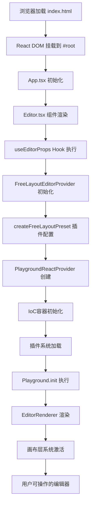
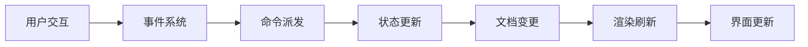

# FlowGram.AI Editor.tsx 启动流程详解

## 🚀 完整启动流程图



## 📋 详细步骤分析

### 第 1 步：应用启动入口

**文件**: `apps/demo-free-layout/index.html`

```html
<!DOCTYPE html>
<html lang="en" data-bundler="rspack">
  <head>
    <title>Flow FreeLayoutEditor Demo</title>
  </head>
  <body>
    <div id="root"></div>
    <!-- React 挂载点 -->
  </body>
</html>
```

**说明**:

- 创建基础 DOM 结构
- 提供 `#root` 挂载点给 React 应用

---

### 第 2 步：React 应用初始化

**文件**: `apps/demo-free-layout/src/App.tsx`

```typescript
import { createRoot } from "react-dom/client";
import { unstableSetCreateRoot } from "@flowgram.ai/form-materials";
import { Editor } from "./editor";

// React 18/19 兼容性设置
unstableSetCreateRoot(createRoot);

// 创建React根节点并渲染Editor组件
const app = createRoot(document.getElementById("root")!);
app.render(<Editor />);
```

**关键操作**:

1. **React 18 兼容**: 设置 `createRoot` 为 form-materials 使用
2. **DOM 挂载**: 将 React 应用挂载到 `#root` 元素
3. **组件渲染**: 渲染主要的 `<Editor />` 组件

---

### 第 3 步：Editor 组件初始化

**文件**: `apps/demo-free-layout/src/editor.tsx`

```typescript
export const Editor = () => {
  // 🔧 配置编辑器属性
  const editorProps = useEditorProps(initialData, nodeRegistries);

  return (
    <div className="doc-free-feature-overview">
      {/* 🏗️ 核心编辑器提供者 */}
      <FreeLayoutEditorProvider {...editorProps}>
        <div className="demo-container">
          {/* 🎨 画布渲染器 */}
          <EditorRenderer className="demo-editor" />
        </div>
        {/* 🛠️ 工具栏 */}
        <DemoTools />
      </FreeLayoutEditorProvider>
    </div>
  );
};
```

**执行步骤**:

1. **配置计算**: `useEditorProps` 计算编辑器完整配置
2. **提供者创建**: `FreeLayoutEditorProvider` 创建上下文
3. **渲染器初始化**: `EditorRenderer` 准备画布渲染
4. **工具栏加载**: `DemoTools` 提供交互工具

---

### 第 4 步：编辑器配置计算

**文件**: `apps/demo-free-layout/src/hooks/use-editor-props.tsx`

```typescript
export function useEditorProps(
  initialData: FlowDocumentJSON,
  nodeRegistries: FlowNodeRegistry[]
): FreeLayoutProps {
  return useMemo<FreeLayoutProps>(
    () => ({
      // 🎯 基础配置
      background: true,
      readonly: false,
      twoWayConnection: true,
      initialData,
      nodeRegistries,

      // 🎛️ 画布配置
      playground: {
        preventGlobalGesture: true, // 阻止Mac手势
      },

      // 🔧 引擎配置
      nodeEngine: { enable: true },
      variableEngine: { enable: true, layout: "free" },

      // 🔌 插件配置
      plugins: () => [
        createFreeLinesPlugin({}),
        createFreeNodePanelPlugin({}),
        createContainerNodePlugin({}),
        createFreeGroupPlugin({}),
        createRuntimePlugin({ mode: "browser" }),
        createPanelManagerPlugin({}),
      ],
    }),
    []
  );
}
```

**配置内容**:

- ⚙️ **基础设置**: 背景、只读模式、双向连接
- 🎨 **画布设置**: 手势阻止、自动聚焦
- 🔧 **引擎启用**: 节点引擎、变量引擎
- 🔌 **插件列表**: 连线、面板、容器、分组、运行时等插件

---

### 第 5 步：自由布局提供者初始化

**文件**: `packages/client/free-layout-editor/src/components/free-layout-editor-provider.tsx`

```typescript
export const FreeLayoutEditorProvider = forwardRef<
  FreeLayoutPluginContext,
  FreeLayoutProps
>(function FreeLayoutEditorProvider(props: FreeLayoutProps, ref) {
  // 🏗️ 创建插件预设
  const preset = useMemo(() => createFreeLayoutPreset(others), []);

  // 🔧 创建自定义插件上下文
  const customPluginContext = useCallback(
    (container: interfaces.Container) => ({
      ...createPluginContextDefault(container),
      get document(): WorkflowDocument {
        return container.get<WorkflowDocument>(WorkflowDocument);
      },
      get selection(): SelectionService {
        return container.get<SelectionService>(SelectionService);
      },
      get history(): HistoryService {
        return container.get<HistoryService>(HistoryService);
      },
      get tools(): FreeLayoutPluginTools {
        return {
          autoLayout: autoLayoutTool.handle,
          fitView: fitViewFunction,
        };
      },
    }),
    []
  );

  return (
    <PlaygroundReactProvider
      ref={ref}
      plugins={preset}
      customPluginContext={customPluginContext}
    >
      {children}
    </PlaygroundReactProvider>
  );
});
```

**关键步骤**:

1. **插件预设**: 调用 `createFreeLayoutPreset` 创建插件配置
2. **上下文扩展**: 创建自由布局特定的服务上下文
3. **提供者包装**: 使用 `PlaygroundReactProvider` 包装子组件

---

### 第 6 步：插件预设系统

**文件**: `packages/client/free-layout-editor/src/preset/free-layout-preset.ts`

```typescript
export function createFreeLayoutPreset(opts: FreeLayoutProps): PluginsProvider {
  return (ctx: FreeLayoutPluginContext) => {
    let plugins: Plugin[] = [];

    // 🔧 加载默认编辑器插件
    plugins = createDefaultPreset(opts as EditorProps, plugins)(ctx);

    // 🔗 变量引擎插件
    if (opts.variableEngine?.enable) {
      plugins.push(
        createVariablePlugin({
          ...opts.variableEngine,
          layout: "free",
        })
      );
    }

    // 📝 历史记录插件
    if (opts.history?.enable) {
      plugins.push(createFreeHistoryPlugin(opts.history));
    }

    // 🎨 自由布局特定插件
    plugins.push(
      createSelectBoxPlugin({}), // 选择框
      createFreeStackPlugin({}), // 层级管理
      createFreeLinesPlugin({}), // 连线系统
      createFreeHoverPlugin({}), // 悬停效果
      createFreeAutoLayoutPlugin({}) // 自动布局
    );

    return plugins;
  };
}
```

**插件加载顺序**:

1. **核心插件**: 基础编辑器功能
2. **引擎插件**: 变量、历史记录
3. **布局插件**: 自由布局专用功能

---

### 第 7 步：Playground 容器初始化

**文件**: `packages/canvas-engine/core/src/react/playground-react-provider.tsx`

```typescript
export const PlaygroundReactProvider = forwardRef((props, ref) => {
  // 🏗️ 创建IoC容器
  const container = useMemo(() => {
    const flowContainer = createPlaygroundContainer(
      {
        autoFocus: true,
        autoResize: true,
        zoomEnable: true,
        ...others,
      },
      fromContainer
    );

    // 📦 加载容器模块
    if (containerModules) {
      containerModules.forEach((module) => flowContainer.load(module));
    }

    return flowContainer;
  }, []);

  // 🎮 创建Playground实例
  const playground = useMemo(() => {
    const playground = container.get(Playground);
    const ctx = customPluginContext
      ? customPluginContext(container)
      : container.get<PluginContext>(PluginContext);

    // 🔌 加载插件
    if (plugins) {
      loadPlugins(plugins(ctx), container);
    }

    // 🚀 初始化playground
    playground.init();
    return playground;
  }, []);

  return (
    <PlaygroundReactContainerContext.Provider value={container}>
      <PlaygroundReactRefContext.Provider value={playground}>
        <PlaygroundReactContext.Provider value={playgroundContext}>
          {props.children}
        </PlaygroundReactContext.Provider>
      </PlaygroundReactRefContext.Provider>
    </PlaygroundReactContainerContext.Provider>
  );
});
```

**核心操作**:

1. **IoC 容器**: 创建依赖注入容器
2. **服务注册**: 注册各种服务到容器
3. **插件加载**: 按照配置加载所有插件
4. **上下文提供**: 提供三层 React 上下文

---

### 第 8 步：插件系统加载

**文件**: `packages/canvas-engine/core/src/plugin/plugin.ts`

```typescript
export function loadPlugins(
  plugins: Plugin[],
  container: interfaces.Container
): void {
  // 🔄 去重和排序
  const singletonPluginIds = new Set<string>();
  const modules: interfaces.ContainerModule[] = plugins
    .reduceRight((result: Plugin[], plugin: Plugin) => {
      const shouldSkip =
        plugin.singleton && singletonPluginIds.has(plugin.pluginId);
      if (plugin.singleton) {
        singletonPluginIds.add(plugin.pluginId);
      }
      return shouldSkip ? result : [plugin, ...result];
    }, [])
    .reduce((res, plugin) => {
      // 🚀 初始化插件
      if (!pluginInitSet.has(plugin.pluginId)) {
        plugin.initPlugin();
        pluginInitSet.add(plugin.pluginId);
      }

      // 📦 收集容器模块
      if (plugin.containerModules && plugin.containerModules.length > 0) {
        res.push(...plugin.containerModules);
      }
      return res;
    }, []);

  // 📥 加载模块到容器
  modules.forEach((module) => container.load(module));

  // 🔗 绑定贡献点
  plugins.forEach((plugin) => {
    if (plugin.contributionKeys) {
      for (const contribution of plugin.contributionKeys) {
        container.bind(contribution).toConstantValue(plugin.options);
      }
    }
  });
}
```

**加载流程**:

1. **去重处理**: 单例插件只初始化一次
2. **初始化**: 调用每个插件的 `initPlugin()`
3. **模块注册**: 将插件的容器模块加载到 IoC 容器
4. **贡献点绑定**: 注册插件的贡献点

---

### 第 9 步：Playground 核心初始化

**文件**: `packages/canvas-engine/core/src/playground.ts`

```typescript
@injectable()
export class Playground implements Disposable {
  constructor(
    @inject(EntityManager) readonly entityManager: EntityManager,
    @inject(PlaygroundRegistry) readonly registry: PlaygroundRegistry,
    @inject(PipelineRenderer) readonly pipelineRenderer: PipelineRenderer // ... 其他服务注入
  ) {
    // 🏗️ 创建DOM节点
    this.node = playgroundConfig.node || document.createElement("div");
    this.config.playgroundDomNode = this.node;

    // 🎨 设置样式类
    this.node.classList.add("gedit-playground");
    this.node.dataset.testid = "sdk.workflow.canvas";

    // 📦 注册层级
    if (playgroundConfig.layers) {
      playgroundConfig.layers.forEach((layer) =>
        this.registry.registerLayer(layer)
      );
    }

    // 🖱️ 绑定焦点事件
    this.node.addEventListener("blur", () => this.blur());
    this.node.addEventListener("focus", () => this.focus());
    this.node.tabIndex = 0;

    // 🎯 挂载渲染器
    this.node.appendChild(this.pipelineRenderer.node);
  }

  init(): void {
    // 🚀 初始化注册表
    this.registry.init();

    // 🔧 初始化渲染管道
    this.pipelineRenderer.init();

    // 📋 加载贡献者
    this.contributionProvider?.getContributions().forEach((contrib) => {
      contrib.registerPlayground?.(this);
    });
  }
}
```

**初始化步骤**:

1. **DOM 创建**: 创建画布容器 DOM 节点
2. **事件绑定**: 绑定焦点和滚动事件
3. **注册表初始化**: 初始化层级注册表
4. **渲染器挂载**: 将渲染器添加到 DOM
5. **贡献者加载**: 处理所有贡献者注册

---

### 第 10 步：渲染器激活

**文件**: `packages/canvas-engine/core/src/react/playground-react-renderer.tsx`

```typescript
export const PlaygroundReactRenderer = (props) => {
  const playground = usePlayground();
  const playgroundConfig = useService<PlaygroundConfig>(PlaygroundConfig);
  const ref = useRef<any>();

  useEffect(() => {
    // 🏗️ 设置父容器
    playground.setParent(ref.current);

    // 🚀 准备就绪
    playground.ready();

    // 🎯 自动聚焦
    if (playgroundConfig.autoFocus) {
      playground.node.focus();
    }
  }, []);

  // 🎨 转换为React组件
  const PlaygroundComp = playground.toReactComponent();

  return (
    <>
      <div ref={ref} className="gedit-playground-container" />
      <PlaygroundComp />
      {props.children
        ? ReactDOM.createPortal(<>{props.children}</>, playground.node)
        : null}
    </>
  );
};
```

**渲染步骤**:

1. **父容器设置**: 将 playground 挂载到 ref 容器
2. **就绪触发**: 调用 `playground.ready()` 激活所有层级
3. **自动聚焦**: 让画布获得键盘焦点
4. **React 集成**: 通过 Portal 将子组件渲染到画布内

---

### 第 11 步：层级系统激活

当 `playground.ready()` 被调用时：

```typescript
// 各个层级开始工作
PlaygroundLayer.onReady(); // 基础层：处理缩放、拖拽
FlowNodesContentLayer.onReady(); // 节点内容层：渲染节点
FlowLinesLayer.onReady(); // 连线层：渲染连接线
FlowScrollBarLayer.onReady(); // 滚动条层：处理滚动
// ... 其他插件层级
```

---

### 第 12 步：用户界面就绪

最终用户看到的完整界面：

```html
<div class="doc-free-feature-overview">
  <!-- React上下文提供者层 -->
  <div class="demo-container">
    <!-- 画布容器 -->
    <div class="gedit-playground-container demo-editor">
      <!-- FlowGram画布 -->
      <div class="gedit-playground" data-testid="sdk.workflow.canvas">
        <!-- 渲染管道 -->
        <div class="pipeline-renderer">
          <!-- 各种功能层级 -->
          <div class="playground-layer">...</div>
          <div class="nodes-content-layer">...</div>
          <div class="lines-layer">...</div>
          <div class="scrollbar-layer">...</div>
        </div>
      </div>
    </div>
  </div>
  <!-- 工具栏 -->
  <div class="demo-free-layout-tools">...</div>
</div>
```

## 🔄 运行时数据流

### 状态管理流程



### 关键服务协作

- **WorkflowDocument**: 管理节点和连线数据
- **SelectionService**: 处理选择状态
- **HistoryService**: 管理撤销/重做
- **CommandService**: 统一命令派发
- **VariableEngine**: 处理变量解析

## 🎯 关键设计亮点

### 1. **分层初始化**

每个步骤都有明确的职责，避免循环依赖

### 2. **插件驱动**

通过插件系统实现功能的模块化和可扩展性

### 3. **IoC 容器**

使用依赖注入实现服务解耦和测试友好

### 4. **React 集成**

完美集成 React 生态，支持 HOC 和 Hook 模式

### 5. **性能优化**

使用 useMemo、useCallback 等优化重复计算

这个启动流程展现了现代前端架构的最佳实践：**模块化**、**可扩展**、**类型安全**、**性能优化**！
